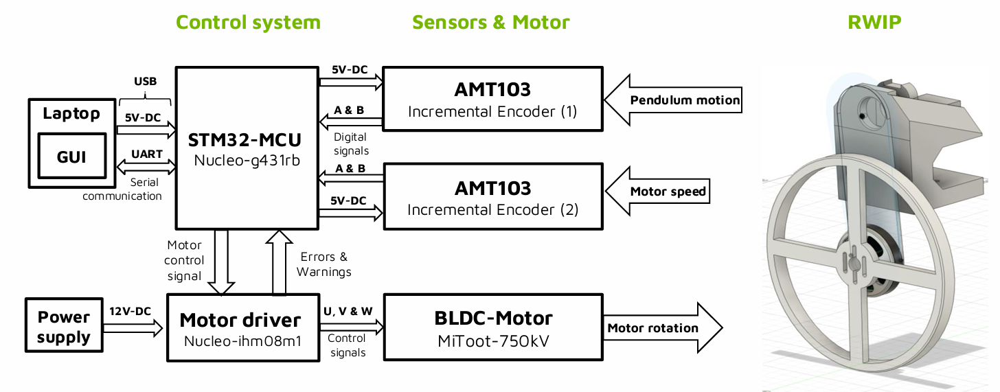
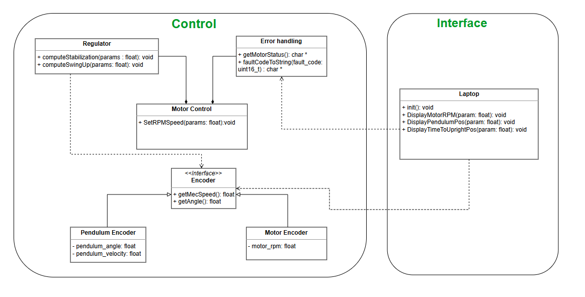
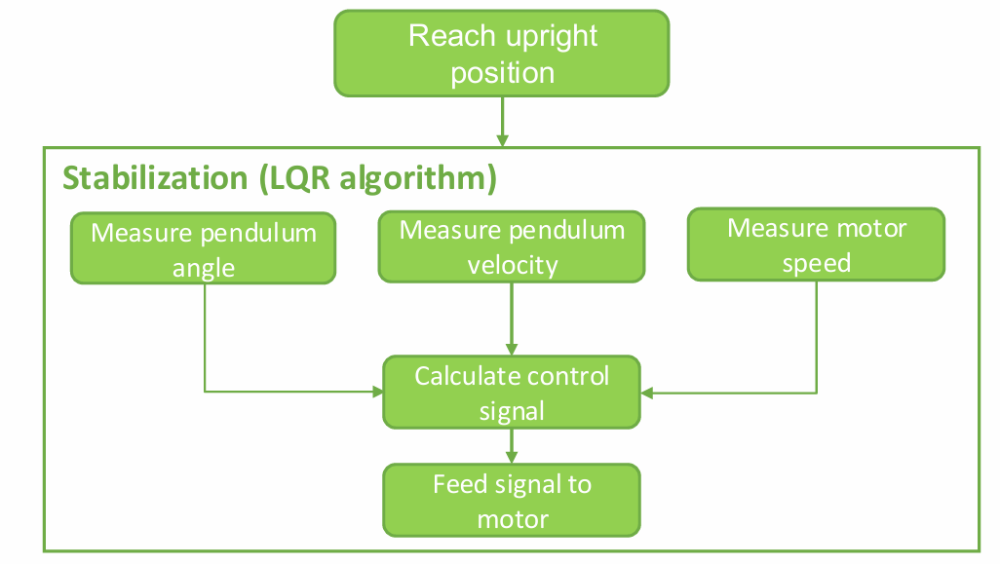
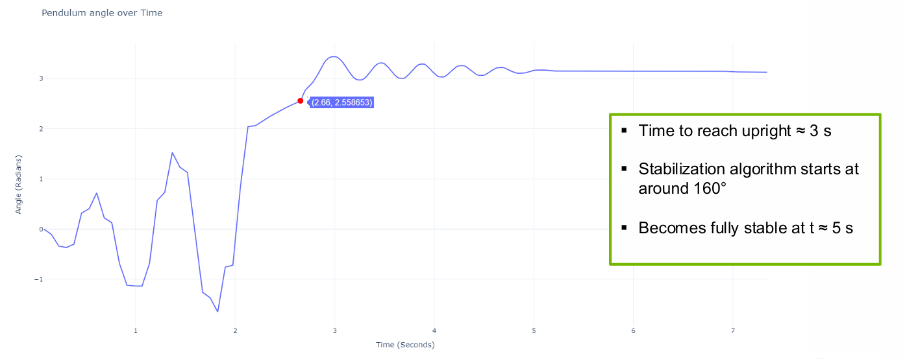
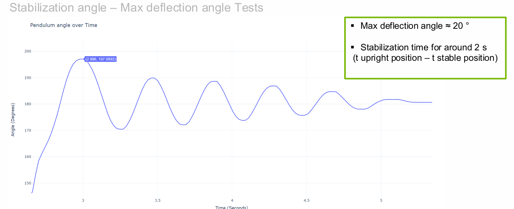
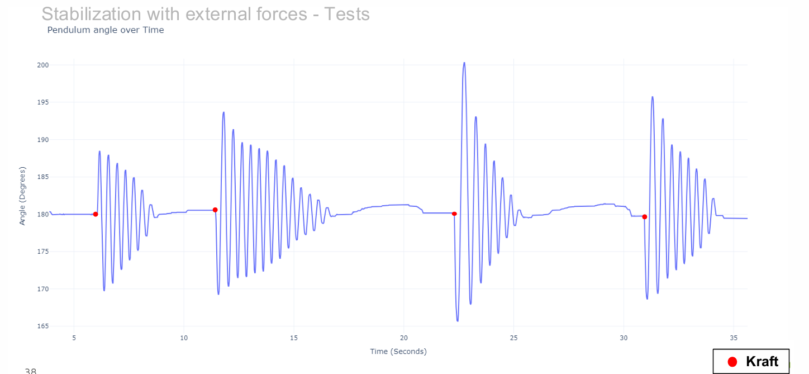

  

# 🌀 Reaction Wheel Inverted Pendulum (RWIP)

A mechatronic control system that balances a pendulum in the upright position using a reaction wheel and feedback control algorithms.

> 🚧 Version: **v1.0**  
> 🗓️ Finalized: **January 2024**  
> 🧑‍💻 Developed by: **Ghassen Jamoussi, Group-B @ HTW Berlin**

---

## 📌 Project Summary

The RWIP system uses a reaction wheel to control the balance of an inverted pendulum. It integrates real-time feedback, control algorithms (Swing-Up and LQR stabilization), and a graphical interface for monitoring and interaction.

### Key Highlights

- Real-time stabilization of a pendulum
- Control algorithm implemented in STM32
- 3D-modeled mechanical design with laser-cut acrylic parts

---

## 🎯 Objectives

- Integrate all RWIP subsystems (hardware, software, mechanical)
- Test swing-up and stabilization mechanisms
- Fix bugs and non-functional issues
- Create documentation and user manuals

---

## 🛠️ System Architecture

### 🔌 Hardware Architecture

The Reaction Wheel Inverted Pendulum system is built around an STM32 microcontroller and real-time feedback from motor and pendulum sensors.

#### 🧱 System Components

##### 🖥️ Control System

- **STM32 Nucleo-G431RB**: Central microcontroller running control logic (Swing-Up and LQR)
- **Laptop GUI**: Communicates with STM32 via UART over USB for logging, visualization, and commands
- **Motor Driver (X-Nucleo-IHM08M1)**: Drives the BLDC motor with up to 15A RMS current
- **Power Supply**: 12V DC powering motor driver and 5V DC powering MCU and sensors

##### ⚙️ Sensors & Actuators

- **AMT103 Incremental Encoder (1)**: Measures pendulum angular position
- **AMT103 Incremental Encoder (2)**: Measures motor shaft speed
- **BLDC Motor (MiToot-750kV)**: Provides reaction torque to balance the pendulum

#### 📡 Signal Flow Overview

- **Sensor Data**: Encoders send quadrature signals (A & B) to the MCU
- **Control Execution**: STM32 computes motor commands based on encoder data
- **Actuation**: Control signal is sent to the motor driver → drives BLDC motor
- **Feedback Loop**: Motor rotation causes reaction torque to balance pendulum

#### 🔁 Communication

- UART: For GUI interaction and monitoring
- GPIO/PWM: For encoder reading and motor control

---

### 💻 Software Architecture

---

## 🧠 Stabilization Algorithm (LQR Control)

The Reaction Wheel Inverted Pendulum (RWIP) uses a **Linear Quadratic Regulator (LQR)** algorithm for real-time stabilization after reaching the upright position.

### 🔁 Control Loop Steps

1. **Reach upright position** – The pendulum is first brought to the inverted position using a swing-up mechanism.

2. **Enter LQR Stabilization Loop** – The following steps repeat continuously:
   - **Measure pendulum angle**
   - **Measure pendulum velocity**
   - **Measure motor speed**
   - **Calculate control signal** using:
     \[
     u = -Kx \quad \text{where } x = [\theta, \dot{\theta}, \omega]^\top
     \]
   - **Feed signal to motor**

This loop ensures the pendulum remains upright by minimizing a quadratic cost function defined over state deviations and control effort.

---

## 🧪 Test Results

### 🔄 Integration of Swing-Up and Stabilization

This test validates the combined behavior of the swing-up algorithm and the LQR stabilization loop. The pendulum starts from rest and is brought to the upright position, then stabilized.

#### 📈 Results Summary

- **Time to reach upright**: ≈ 3 seconds
- **Stabilization algorithm starts**: At ≈ 160° (≈ 2.8 radians)
- **System becomes fully stable**: At ≈ 5 seconds

---

### 📐 Stabilization Angle – Max Deflection

This test evaluates the pendulum's behavior during the stabilization phase, focusing on overshoot and settling time.

#### 📈 Results Summary

- **Max deflection angle**: ≈ 20° (from vertical)
- **Stabilization time**: ≈ 2 seconds  
  _(Time from reaching upright to achieving steady-state oscillation)_

---

### 🛡️ Stabilization with External Forces

This test evaluates the robustness of the LQR controller under repeated external disturbances.

#### 📈 Results Summary

- **Test setup**: External forces ("Kraft") applied at ≈ 6s, 12s, 21s, and 29s
- **Response**: Each disturbance triggers oscillations, followed by return to equilibrium
- **Recovery time**: Stabilization is consistently achieved within a few seconds.
