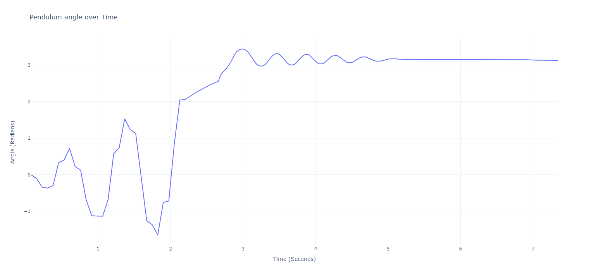
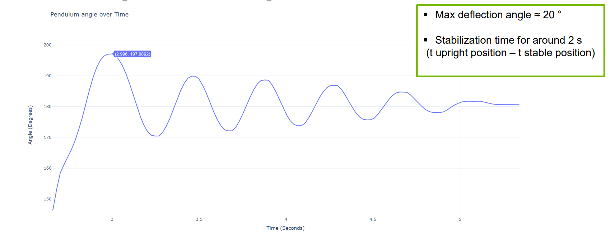
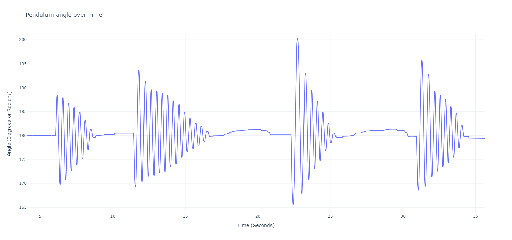

# RWIP Project detailed test results and analysis documentation

## Introduction
This document presents a detailed analysis of the test results for the Rotation Wheel Inverted Pendulum (RWIP) system. The RWIP project's aim is to demonstrate the practical application of control theory principles by stabilizing an inverted pendulum through the rotation of an attached wheel. The system underwent a series of tests to evaluate its performance in terms of swing-up time, stabilization response, deflection handling, and its capacity to withstand external forces.

## Analysis of Test Results

### Integration of Swing-Up and Stabilization

- **Time to Upright Position**: The system consistently achieved an upright position in approximately 3 seconds, which indicates a rapid response from the swing-up control algorithm. The curve during this phase shows an aggressive initial acceleration, followed by a deceleration as the pendulum approaches the upright position, which is typical of a well-tuned swing-up mechanism.

- **Stabilization Initiation**: The stabilization algorithm was triggered when the pendulum reached an angle close to 160°. The control logic is designed to wait for the pendulum to enter a specific angular threshold before engaging the stabilization routine, which is evident from the smoother curve past the 160° mark, indicating controlled damping movements.

- **Achieving Full Stability**: Full stability was achieved at around 5 seconds, as indicated by the reduced amplitude of oscillations in the curve. This proves the control system's gains are well-calibrated, allowing for quick dampening of oscillations and maintaining the pendulum in an upright position.

### Stabilization Angle and Max Deflection Angle

- **Maximum Deflection Angle**: The maximum deflection angle recorded was 20°, which is within the expected performance parameters for a stable system. The curve showed regular oscillations with decreasing amplitude, signifying the system's ability to correct for angle deviations and return to the stable point efficiently.

- **Stabilization Time**: The stabilization time of around 2 seconds from the upright position indicates a robust control system capable of quickly counteracting deviations and restoring equilibrium.

### Stabilization with External Forces

- The test for stabilization under external forces displayed the system's resilience. The curve showed spikes corresponding to the application of external forces, followed by a rapid return to stability. This demonstrates the system's ability to compensate for disturbances, a critical feature for real-world applications.

- There are some deviations to 181° after reaching the stable position again, because we are using a ring to provide some friction for the stabilization and the current ring that we have is not 100% stable, therefore a deviation of 1 to 2° are sometimes to be expected.

### Comparative Results with Previous Models

- **M5 vs. M6**: The current (M6) shows a marked improvement over the previous (M5). The significant decrease in swing-up time from 12 seconds to 2 seconds and the ability to stabilize indefinitely as opposed to just 13 seconds are indicative of a highly optimized control system. Moreover, M6's capacity to handle major forces, compared to M5's limitation to minor forces, along with a tenfold increase in the maximum deflection angle tolerance, underscores the advancements in the control algorithms and the overall system design.

## Conclusion
The RWIP project's tests reveal that the current model (M6) outperforms the previous iteration (M5) in every tested aspect. The faster swing-up, more prolonged stabilization, and better response to external disturbances highlight the efficacy of the system's control mechanisms. The detailed curve analysis corroborates the test notes, showing the system's ability to reach and maintain an upright position quickly and to withstand significant external forces without losing stability.