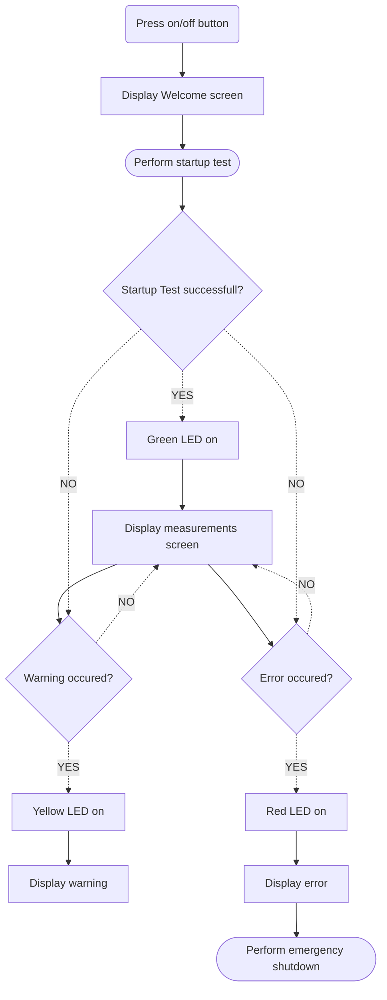

# User Interface Specification for RWIP System

### Introduction:
The User Interface (UI) plays a crucial role in our Reaction Wheel Inverted Pendulum (RWIP) system, providing essential functionalities for user interaction, system control, and monitoring. This document outlines the specific requirements and functionality expected from the UI.
## User Interface Objectives:

The objectives of the User Interface (UI) are as follows:

1. **Start and Stop Control:**
   - Enable the user to initiate and terminate the operation of the RWIP system using a dedicated button.
2. **Display Live Measurements:**
   - Display real-time sensor measurements on the OLED screen (for example: pendulum angle, motor RPM)
3. **Error Notification:**
   - Promptly notify users of any occurring errors, originating from the motor driver board or encoders via the microcontroller.

### User interface Components:

#### led Display:
- The display shall show the live sensor measurements.
- The display shall show the maximal possible deflection angle.
- The display shall show the time needed to reach the upright position.
- The diplay shall log the details of the warnings and errors.

#### LEDs:
- *Green*: Illuminates when the system is powered on and functioning without any reported issues, indicating normal operation.
- *Yellow*:  Lights up in the event of a warning, providing users with immediate notification of a non-critical issue.
- *Red*:    Signals a critical error in the system, necessitating immediate system shutdown (except the display).

#### Buttons:
- *On/Off button*: Enables users to power on or shut down the RWIP system. A long press initiates emergency shutdown.
- *Emergency shutdown button*: Provides an immediate and forceful system shutdown in case of an emergency or critical situation.

### User Interaction Workflow:

### Display basic mockup:

### Conclusion:
The User Interface Specification for the Reaction Wheel Inverted Pendulum (RWIP) system outlines the essential functionalities and components required for user interaction.The provided workflow and mockup offer a visual guide to user interaction. This specification lays the foundation for a user-friendly and efficient UI for the RWIP system.
